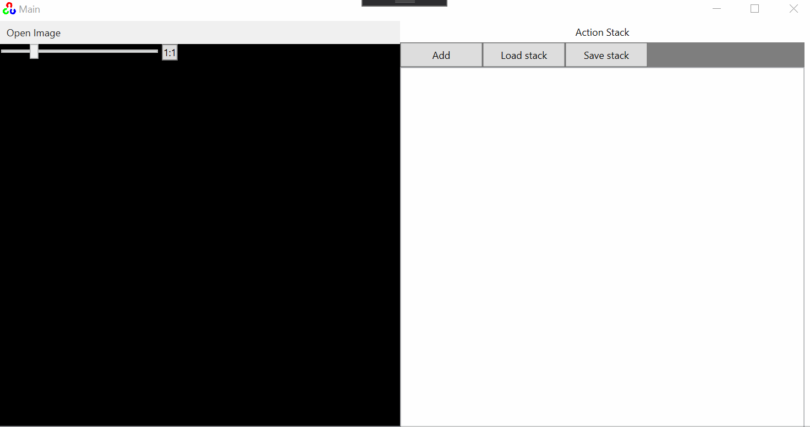
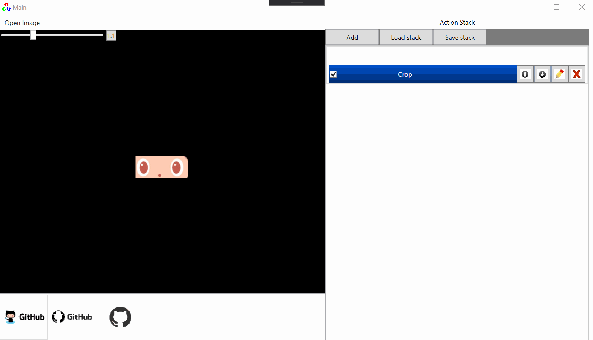

# Added features in this repository:

### Zoom / Scrolbars

- Zoom with mouse wheel / slider
- Drag with left mouse button

### Open multiple files

- Open multiple files at once
- Switch between the files in the bottom list

### Improved action stack

- New actions are auto-detected
- Temporary disable actions
- Save/Load actions in file
- Implemented action groups
- Added some actions (Unsharp mask, crop, extract recangle, ...)

# Original Readme: OpenCVPlaygound
A playground app for testing algorithms in OpenCV

Check out my video below which explains and demos this app and describes how to contribute:

